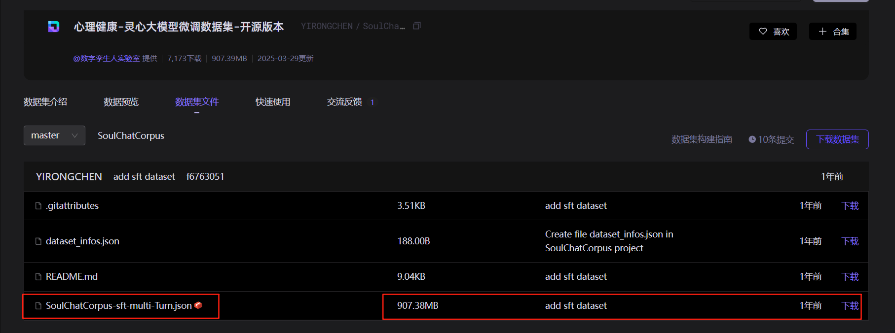

# 心理咨询聊天机器人

<div align="center">
  
  
  
  
  
</div>

## 📖 项目介绍

**XJU2025 7月人工智能实训项目**

这是一个基于大语言模型（LLM）的智能心理咨询聊天机器人，旨在为用户提供专业、温暖、24小时可用的心理健康支持服务。项目采用现代化的前后端分离架构，集成了先进的RAG（检索增强生成）技术和多模态对话能力。

### ✨ 核心特性

- 🧠 **智能对话**: 基于大语言模型的自然语言理解与生成
- 📚 **知识库检索**: RAG技术支持的专业心理学知识问答
- 💭 **情感识别**: 智能识别用户情绪状态并提供针对性回应
- 🔒 **隐私保护**: 支持内存模式，无持久化存储敏感对话
- ⚡ **实时响应**: 流式对话支持，提供流畅的交互体验
- 🎯 **上下文管理**: 智能上下文窗口控制，平衡性能与对话连贯性
- 🌐 **跨平台**: Web端界面，支持多设备访问

## 🏗️ 软件架构

```
心理咨询聊天机器人
├── 前端 (Vue.js 3 + TypeScript)
│   ├── 现代化UI界面
│   ├── 实时聊天组件
│   └── 响应式设计
├── 后端 (FastAPI + Python)
│   ├── RESTful API服务
│   ├── WebSocket实时通信
│   ├── LangChain集成
│   └── 向量数据库
└── AI模型层
    ├── 大语言模型 (DeepSeek/ChatGPT)
    ├── 向量嵌入模型
    └── 心理学知识库
```

### 🔧 技术栈

**后端技术**:
- **FastAPI**: 高性能异步Web框架
- **LangChain**: LLM应用开发框架
- **ChromaDB**: 向量数据库，支持语义检索
- **Pydantic**: 数据验证和序列化
- **Poetry**: 依赖管理和打包工具

**前端技术**:
- **Vue.js 3**: 渐进式JavaScript框架
- **TypeScript**: 类型安全的JavaScript超集
- **Vite**: 现代化构建工具
- **Element Plus**: Vue 3组件库

**AI技术**:
- **RAG (检索增强生成)**: 结合知识库的智能问答
- **向量嵌入**: BGE模型支持的语义理解
- **多轮对话**: 上下文感知的连续对话

## 📦 安装教程

### 环境要求

- Python 3.10
- Node.js v24.4
- Git

### 1. 克隆项目

```bash
git clone https://gitee.com/your-username/psychological-health-chatbot.git
cd psychological-health-chatbot
```

### 2. 后端安装

```bash
cd server/mvp-llm-app-scaffold

# 安装Poetry (如果未安装)
curl -sSL https://install.python-poetry.org | python3 -

# 安装依赖
poetry install

# 配置环境变量
cp .env.example .env
# 编辑.env文件，配置API密钥等信息
```

### 3. 前端安装

```bash
cd fronted/chatgpt-vue3-light-mvp

# 安装依赖
npm install
# 或使用pnpm
pnpm install
```

### 4. 数据准备
#### 下载知识库数据集 链接：https://modelscope.cn/datasets/YIRONGCHEN/SoulChatCorpus/files


将这个文件放在data_sample目录下面，并重命名为dataset.json
```bash
# 回到后端目录
cd server/mvp-llm-app-scaffold
# 运行inget.py 加载心理学知识库数据
poetry run ingest --source data_sample --batch-size 1000
```

### 5. bge-small 模型下载
```bash
# 回到后端目录
cd server/mvp-llm-app-scaffold
# 创建models目录
mkdir models
#进入当前目录，git下载 bge 模型
cd models
# 科学上网，配置git代理 你需要把端口号，修改成自己电脑上clash里面的。例如把7899修改成2025
git config --global http.proxy http://127.0.0.1:7899
git config --global https.proxy http://127.0.0.1:7899

# 下载模型
git clone https://huggingface.co/BAAI/bge-small-zh

# 加载心理学知识库数据
poetry run ingest --source data_sample --batch-size 1000
```
 
## 🚀 使用说明

### 1. 启动后端服务

```bash
cd server/mvp-llm-app-scaffold
poetry run uvicorn app.api.main:app --host 0.0.0.0 --port 8000 --reload
```

服务启动后访问: http://localhost:8000

### 2. 启动前端服务

```bash
cd fronted/chatgpt-vue3-light-mvp
npm run dev
```

前端服务启动后访问: http://localhost:2048

### 3. API接口使用

#### 知识库聊天接口

```bash
curl -X POST "http://localhost:8000/api/kb_chat/" \
  -H "Content-Type: application/json" \
  -d '{
    "query": "什么是心理健康？",
    "conversation_id": "user123",
    "context_window": 10,
    "use_memory_only": false
  }'
```
## 📁 项目结构

```
psychological-health-chatbot/
├── fronted/                    # 前端代码
│   └── chatgpt-vue3-light-mvp/
│       ├── src/               # Vue.js源码
│       ├── public/            # 静态资源
│       └── package.json       # 前端依赖
├── server/                    # 后端代码
│   └── mvp-llm-app-scaffold/
│       ├── app/              # FastAPI应用
│       │   ├── api/          # API路由
│       │   ├── core/         # 核心功能
│       │   ├── configs/      # 配置文件
│       │   └── services/     # 业务服务
│       ├── data_sample/      # 数据文件(记住要自己去魔塔社区下载数据集并重命名为dataset.json)
│       ├── models/           # 模型文件(这个根据上面的git脚本下载)
│       ├── chroma_db/        # 向量数据库文件
│       ├── scripts/          # 脚本工具
│       └── pyproject.toml    # Python依赖
├── README.md                 # 项目说明
└── start.bat                 # 启动脚本
```

## 🤝 参与贡献

我们欢迎所有形式的贡献！请遵循以下步骤:

1. **Fork 本仓库**
2. **创建特性分支** (`git checkout -b feat/amazing-feature`)
3. **提交更改** (`git commit -m 'Add some amazing feature'`)
4. **推送到分支** (`git push origin feat/amazing-feature`)
5. **创建 Pull Request**

### 贡献指南

- 遵循现有的代码风格和规范
- 添加适当的测试用例
- 更新相关文档
- 确保所有测试通过

## 📄 开源协议

本项目采用 [MIT License](LICENSE) 开源协议。

## 🙏 致谢

- [LangChain](https://github.com/langchain-ai/langchain) - 强大的LLM应用开发框架
- [FastAPI](https://github.com/tiangolo/fastapi) - 现代化的Python Web框架
- [Vue.js](https://github.com/vuejs/vue) - 渐进式JavaScript框架
- [ChromaDB](https://github.com/chroma-core/chroma) - 开源向量数据库

## 📞 联系我们

- 项目地址: [Gitee](https://gitee.com/your-username/psychological-health-chatbot)
- 问题反馈: [Issues](https://gitee.com/your-username/psychological-health-chatbot/issues)
- 邮箱: your-email@example.com

## 🌟 特别说明

1. 使用 `README_en.md` 来支持英文文档
2. 关注 [Gitee 官方博客](https://blog.gitee.com) 获取最新开源资讯
3. 探索更多优秀项目: [Gitee Explore](https://gitee.com/explore)
4. 了解 [GVP 项目](https://gitee.com/gvp) - Gitee 最有价值开源项目
5. 查看 [Gitee 帮助文档](https://gitee.com/help) 获取使用指南
6. 关注 [Gitee 封面人物](https://gitee.com/gitee-stars/) 了解开发者风采

---

<div align="center">
  <p>⭐ 如果这个项目对你有帮助，请给我们一个星标！</p>
  <p>💝 让我们一起为心理健康事业贡献力量</p>
</div>